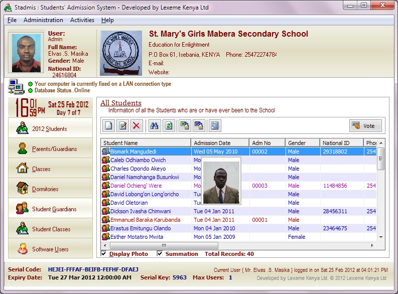



## Student's Admission System v2

### Description

This Students Admission Software uses techniques to add, maintain & retrieve the student information. It efficiently tracks past, future and current details of students in the school admission register. Students information can be spooled to excel format which will lead you to prepare Customized reports. It makes your working smooth while saving about 95% of manual work, resulting into a hassle free and paper less Management.

Has the ability to add/retrieve the detailed information about students so that they can be traced at their later stages in life i.e:-

1. Personal Information

- National Identification Number

- Occupation

- Marital Status

- Deceased/Alive

- E-mail addresses

- Phone numbers

- Birth date

- Student photos can be attached

- Medical Information

2. Guardians/parents

- Personal Information

- Their Students/Children

- Relationship between them and the Students

- Whether s/he pays fees for the Student

3. Class levels

4. Dormitory

5. Sports

6. Clubs

7. Societies

8. Leadership/Prefects

- Prefects

- Start & End Dates; Duration in office

- Prefect Posts

.. Just check it out. Don't forget to vote

Please find a Readme text file in the zip on how to install, configure and run the Software

For more information contact me: elvasmasika@lexeme-kenya.com
 
### More Info
 

             |
---                |---
**Submitted On**   |2012-02-25 16:57:56
**By**             |[Maselv](https://github.com/Planet-Source-Code/PSCIndex/blob/master/ByAuthor/maselv.md)
**Level**          |Advanced
**User Rating**    |4.4 (44 globes from 10 users)
**Compatibility**  |VB 6\.0, VB Script, VBA MS Access, VBA MS Excel
**Category**       |[Complete Applications](https://github.com/Planet-Source-Code/PSCIndex/blob/master/ByCategory/complete-applications__1-27.md)
**World**          |[Visual Basic](https://github.com/Planet-Source-Code/PSCIndex/blob/master/ByWorld/visual-basic.md)
**Archive File**   |[Student's\_2220672262012\.zip](https://github.com/Planet-Source-Code/maselv-student-s-admission-system-v2__1-74289/archive/master.zip)

